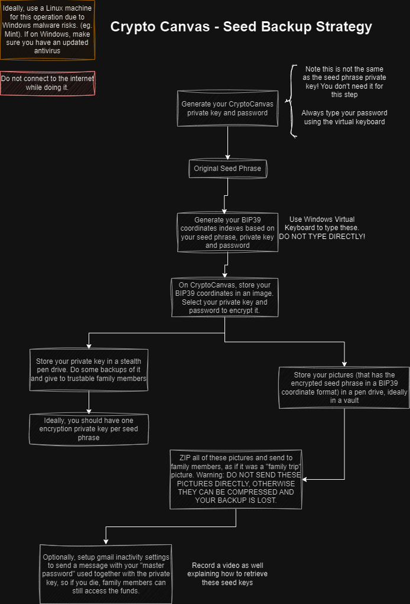

# Getting Started

This diagram outlines a comprehensive seed backup strategy for you, focusing on securely storing and backing up your seed phrase, private key, and password. Here's a detailed explanation, including the use of BIP39 coordinates:

#### Step-by-Step Explanation

1. **Preparation**:

   - **Use a Linux Machine**: We highly recommend you use a Linux machine (e.g., Mint) to avoid Windows malware risks. If using Windows, ensure your antivirus is up to date.
   - **Disconnect from the Internet**: Do not connect to the internet while performing this operation to minimize risks.
   - **Use a virtual keyboard to type**: Use the Windows Virtual Keyboard to type sensitive information securely.
   - **Make sure you bought the wallet from a trusted source**: Ensure your hardware wallet is from the official provider (eg. Ledger or Trezor) to avoid tampering risks.

2. **Generate CryptoCanvas Private Key and Password**:

   - **Virtual Keyboard**: Generate your CryptoCanvas private key and password using the virtual keyboard to prevent keyloggers from capturing your inputs.
     - **Note**: This has nothing to do with your seed phrase private key. It's just a decryption private key you'll use to decrypt the seed phrase or whatever you want to store in the image.

3. **Original Seed Phrase**:

   - **Seed Phrase**: This is your original seed phrase, which you will use to generate BIP39 coordinates. The seed phrase is critical for wallet recovery.

4. **Generate BIP39 Coordinates Indexes**:
   - **BIP39 Coordinates**: Based on your seed phrase, private key, and password, generate the BIP39 coordinate indexes. These indexes represent the positions of the words in the BIP39 wordlist.
   - **Virtual Keyboard**: Use the Windows Virtual Keyboard to type these values securely.

#### Why Use BIP39 Coordinates?

- **Non-Sensitive Storage**: By converting your seed phrase words into their corresponding indexes, you can store these numbers instead of the actual words. This reduces the risk of someone easily recognizing and using your seed phrase if they find the stored data.
- **Added Security**: Since the numbers themselves do not immediately reveal their connection to a seed phrase, it adds an extra layer of security. An attacker would need to know how to interpret these numbers back into the original seed phrase.

5. **Store BIP39 Coordinates on CryptoCanvas**:

   - **Image Storage**: On CryptoCanvas, store your BIP39 coordinates in an image format.
   - **Encryption**: Select your private key and password to encrypt the image.

6. **Backup Encrypted Seed Phrase**:

   - **Pen Drive Storage**: Store the encrypted seed phrase (now in a BIP39 coordinate format) in a pen drive, ideally kept in a vault.

7. **Backup Private Key**:

   - **Stealth Pen Drive**: Store your private key in a stealth pen drive. Create multiple backups and distribute them to trusted family members.
   - **One Key per Seed**: Ideally, have one encryption private key per seed phrase.

8. **Distribute Backups**:

   - **ZIP and Send**: Zip all the encrypted images and send them to family members, disguised as “family trip” pictures.
   - **Warning**: Do not send the pictures directly; ensure they are zipped. If sent directly, they could be compressed and corrupted, losing the backup.

9. **Setup Inactivity Settings**:

   - **Gmail Inactivity Settings**: Optionally, set up Gmail inactivity settings to send a message with your “master password” if you become inactive, ensuring family members can still access the funds.

10. **Create an Instructional Video**:
    - **Record a Video**: Record a video explaining how to retrieve and use the seed keys to ensure your family can access the funds if needed.

#### Important Notes

- **Loss of Private Key and Password**: If you lose your private key and password, you will not be able to revert the BIP39 coordinates back to the original seed phrase. Always store these securely and ensure backups.
- **Verification**: Always generate and revert the seed phrase back to confirm that your backup strategy is working correctly before relying on it for long-term storage.

By following this strategy, you create a secure, redundant backup system for your CryptoCanvas seed phrase, private key, and password, ensuring they are accessible to trusted individuals while minimizing the risk of loss or compromise.
